# QA Automation Platform

[](https://github.com/leorxx11/qa-automation-platform/actions/workflows/test.yml)

接口 + UI 自动化测试项目，运行在自建的 CI 环境上：GitHub Actions **self-hosted runner**（ARM64 云服务器）执行测试，生成 **Allure** 报告并自动发布到 Web 服务。

## 架构

```mermaid
flowchart LR
    Dev[push / PR] --> GH[GitHub Actions]
    GH -->|派发任务| Runner["self-hosted runner<br/>Ubuntu 24.04 · ARM64<br/>低权限用户 · systemd"]
    Runner --> Tests["pytest<br/>requests · Playwright"]
    Tests --> Results[allure-results]
    Results -->|合并历史趋势| Report[Allure HTML 报告]
    Report -->|发布 · 保留最近 20 次| Dir["/srv/allure-reports/&lt;run_id&gt;/<br/>latest → 最新"]
    Dir --> Caddy["Caddy<br/>HTTPS · basic auth"]
    Caddy --> Browser[浏览器查看报告]
    Runner -.->|Job Summary 输出报告链接| GH
```



## 技术栈

| 层 | 选型 |
|---|---|
| 测试框架 | pytest（fixture、参数化、自定义 marker） |
| 接口测试 | requests + JSON Schema 契约校验 |
| UI 测试 | Playwright + Page Object Model，失败自动截图 |
| 报告 | Allure（步骤、请求/响应附件、历史趋势、环境与执行信息） |
| CI | GitHub Actions self-hosted runner（ARM64，systemd 常驻，非 root） |
| 报告服务 | Caddy（自动 HTTPS、basic auth、静态托管） |

## 目录结构

```
├── .github/workflows/test.yml   # CI 流水线
├── pages/                       # Page Object
├── scripts/publish-report.sh    # 报告发布与清理
├── tests/
│   ├── api/                     # 接口测试（JSONPlaceholder）
│   └── ui/                      # UI 测试（TodoMVC）
└── utils/                       # HTTP 客户端、JSON Schema
```

## 本地运行

```bash
python3 -m venv .venv && source .venv/bin/activate
pip install -r requirements.txt
python -m playwright install chromium

pytest                       # 全部
pytest -m api                # 只跑接口
pytest -m ui --headed        # 只跑 UI，并显示浏览器
pytest --alluredir=allure-results && allure serve allure-results   # 本地看报告
```

## CI 流程

1. push 到 `main`、提交 PR 或手动触发时运行
2. 在 self-hosted runner 上安装依赖、执行 pytest，输出 `allure-results`
3. 合并上一次报告的 `history`，生成带趋势图的 Allure 报告
4. 发布到 `/srv/allure-reports/<run_id>/`，更新 `latest`，只保留最近 20 次
5. 在 Job Summary 中输出用例统计和报告链接

**安全：** 仓库公开，来自 fork 的 PR 不会在 self-hosted runner 上执行；runner 以无 sudo 权限的独立用户运行。
